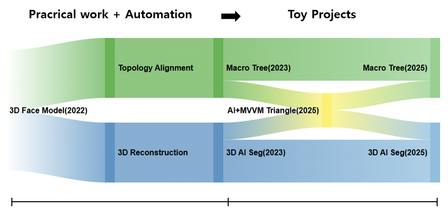

### 🛠️ Skills

         

        

## 

### 🌱 Project Evolution (프로젝트 발전 과정)

<!--
**aoiupen/aoiupen** is a  _special_ ✨ repository because its `README.md` (this file) appears on your GitHub profile.
👋✨
Here are some ideas to get you started:

- 🔭 I’m currently working on ...
- 🌱 I’m currently learning ...
- 👯 I’m looking to collaborate on ...
- 🤔 I’m looking for help with ...
- 💬 Ask me about ...
- 📫 How to reach me: ...
- 😄 Pronouns: ...
- ⚡ Fun fact: ...
-->
